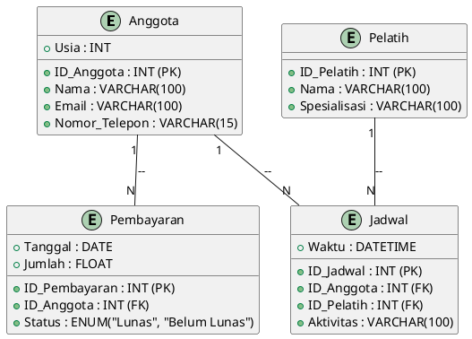
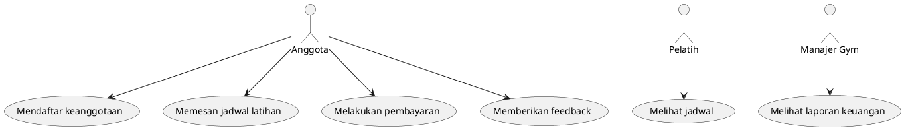
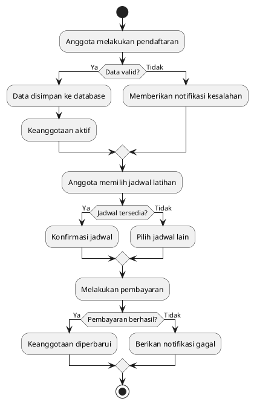

# Laporan Administrasi Gym

## 1. Latar Belakang

Industri kebugaran terus berkembang pesat, terutama di era digital. Gym modern kini tidak hanya menawarkan fasilitas latihan, tetapi juga membutuhkan sistem administrasi yang canggih untuk mengelola keanggotaan, jadwal latihan, pelatih, dan pembayaran secara efisien. Oleh karena itu, dibutuhkan sebuah sistem berbasis teknologi yang dapat mengelola semua aspek administrasi gym secara terintegrasi.

Tujuan dari laporan ini adalah merancang sistem administrasi gym yang dapat meningkatkan efisiensi operasional, transparansi data, dan pengalaman pelanggan.

## 2. Identifikasi Masalah

Beberapa permasalahan utama yang sering dihadapi oleh gym adalah:

1. Sulitnya mengelola data keanggotaan secara manual.
2. Ketidakmampuan untuk melacak jadwal latihan dan ketersediaan pelatih secara real-time.
3. Sistem pembayaran yang tidak terintegrasi dan rawan kesalahan.
4. Kurangnya alat untuk mengevaluasi performa anggota dan pelatih.
5. Tidak adanya sistem pencatatan feedback untuk perbaikan layanan.

## 3. Rumusan Masalah

1. Bagaimana merancang sistem yang dapat mengelola data anggota, pelatih, dan jadwal secara efisien?
2. Bagaimana menciptakan sistem pembayaran yang terintegrasi dan transparan?
3. Bagaimana sistem ini dapat menyediakan laporan evaluasi performa untuk anggota dan pelatih?
4. Bagaimana mengembangkan fitur feedback untuk meningkatkan layanan?

## 4. Tujuan Sistem

1. Mengembangkan sistem administrasi gym berbasis teknologi.
2. Meningkatkan efisiensi operasional melalui pengelolaan data yang terstruktur.
3. Memberikan transparansi dalam proses pembayaran dan pelaporan.
4. Menyediakan evaluasi performa berbasis data untuk anggota dan pelatih.
5. Memfasilitasi pengumpulan dan analisis feedback pelanggan.

## 5. Metode Analisis

### 5.1. What (Apa)
- Sistem ini adalah platform manajemen gym berbasis teknologi yang dirancang untuk mengelola data anggota, pelatih, jadwal, dan pembayaran.
- Fitur utama meliputi pengelolaan keanggotaan, pelatih, jadwal latihan, pembayaran, serta laporan evaluasi.

### 5.2. Why (Mengapa)
- Dibutuhkan untuk meningkatkan efisiensi administrasi, transparansi pembayaran, dan pengalaman pelanggan.
- Untuk memastikan kelancaran operasional gym dan mendukung pertumbuhan bisnis jangka panjang.

### 5.3. Who (Siapa)
- Sistem akan digunakan oleh manajer gym untuk pengelolaan data dan laporan.
- Pelatih untuk melihat jadwal dan melacak performa anggota.
- Anggota untuk memesan jadwal, melakukan pembayaran, dan memberikan feedback.

### 5.4. When (Kapan)
- Implementasi sistem direncanakan dalam waktu enam bulan setelah tahap pengembangan dan pengujian.
- Fitur tambahan dapat direncanakan setelah implementasi awal berdasarkan umpan balik pengguna.

### 5.5. Where (Di Mana)
- Sistem ini digunakan di gym dan dapat diakses secara online melalui web atau aplikasi seluler.
- Dapat diakses dari lokasi manapun dengan koneksi internet untuk mendukung fleksibilitas.

### 5.6. How (Bagaimana)
- Sistem akan dikembangkan menggunakan framework Laravel untuk backend, Vue.js untuk frontend, Docker untuk containerisasi, dan MySQL untuk manajemen data.
- Menggunakan pendekatan Agile dalam pengembangan perangkat lunak untuk memastikan sistem dapat diadaptasi dengan kebutuhan pengguna.
- Melibatkan pengguna dalam tahap pengujian untuk mendapatkan umpan balik secara langsung.

### 5.7. Which (Metode Tambahan)
- Melakukan analisis SWOT untuk mengidentifikasi kekuatan, kelemahan, peluang, dan ancaman dalam implementasi sistem ini.
- Menyediakan pelatihan bagi staf gym untuk memastikan kelancaran adopsi sistem.

## 6. Perancangan Sistem

### 6.1. Entity Relationship Diagram (ERD)



### 6.2. Use Case Diagram



### 6.3. Flowchart



### 6.4. Implementasi Database (SQL)

```sql
CREATE TABLE Anggota (
    ID_Anggota INT PRIMARY KEY AUTO_INCREMENT,
    Nama VARCHAR(100),
    Usia INT,
    Email VARCHAR(100),
    Nomor_Telepon VARCHAR(15)
);

CREATE TABLE Pelatih (
    ID_Pelatih INT PRIMARY KEY AUTO_INCREMENT,
    Nama VARCHAR(100),
    Spesialisasi VARCHAR(100)
);

CREATE TABLE Jadwal (
    ID_Jadwal INT PRIMARY KEY AUTO_INCREMENT,
    ID_Anggota INT,
    ID_Pelatih INT,
    Waktu DATETIME,
    Aktivitas VARCHAR(100),
    FOREIGN KEY (ID_Anggota) REFERENCES Anggota(ID_Anggota),
    FOREIGN KEY (ID_Pelatih) REFERENCES Pelatih(ID_Pelatih)
);

CREATE TABLE Pembayaran (
    ID_Pembayaran INT PRIMARY KEY AUTO_INCREMENT,
    ID_Anggota INT,
    Tanggal DATE,
    Jumlah FLOAT,
    Status ENUM('Lunas', 'Belum Lunas'),
    FOREIGN KEY (ID_Anggota) REFERENCES Anggota(ID_Anggota)
);
```

### 6.5. Konfigurasi Docker untuk Laravel dan MySQL

```yaml
version: '3.8'
services:
  app:
    build: .
    container_name: laravel_app
    volumes:
      - .:/var/www/html
    depends_on:
      - db
  db:
    image: mysql:8
    container_name: mysql_db
    environment:
      MYSQL_ROOT_PASSWORD: root
      MYSQL_DATABASE: gym
      MYSQL_USER: user
      MYSQL_PASSWORD: password
```

## 7. Kesimpulan

Sistem administrasi gym berbasis Laravel, Docker, dan MySQL ini dirancang untuk mengatasi berbagai masalah administrasi, seperti manajemen data anggota, pelatih, jadwal, dan pembayaran. Dengan mengintegrasikan teknologi modern, sistem ini mampu meningkatkan efisiensi operasional, transparansi data, dan kepuasan pelanggan. Implementasi sistem ini akan memberikan solusi yang berkelanjutan dan dapat diandalkan untuk kebutuhan gym modern.

